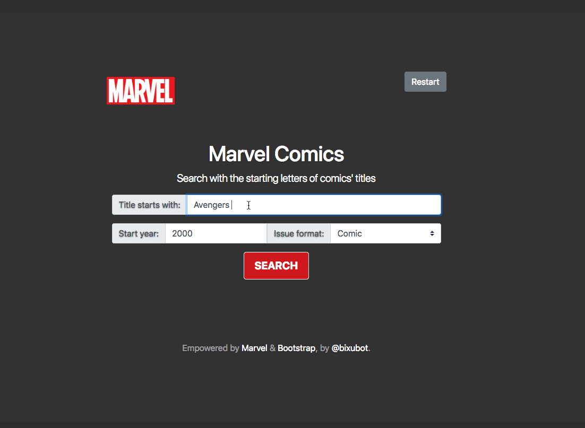
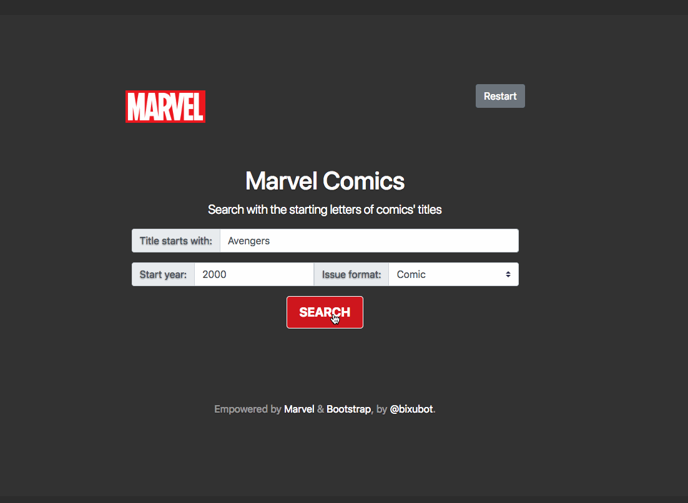
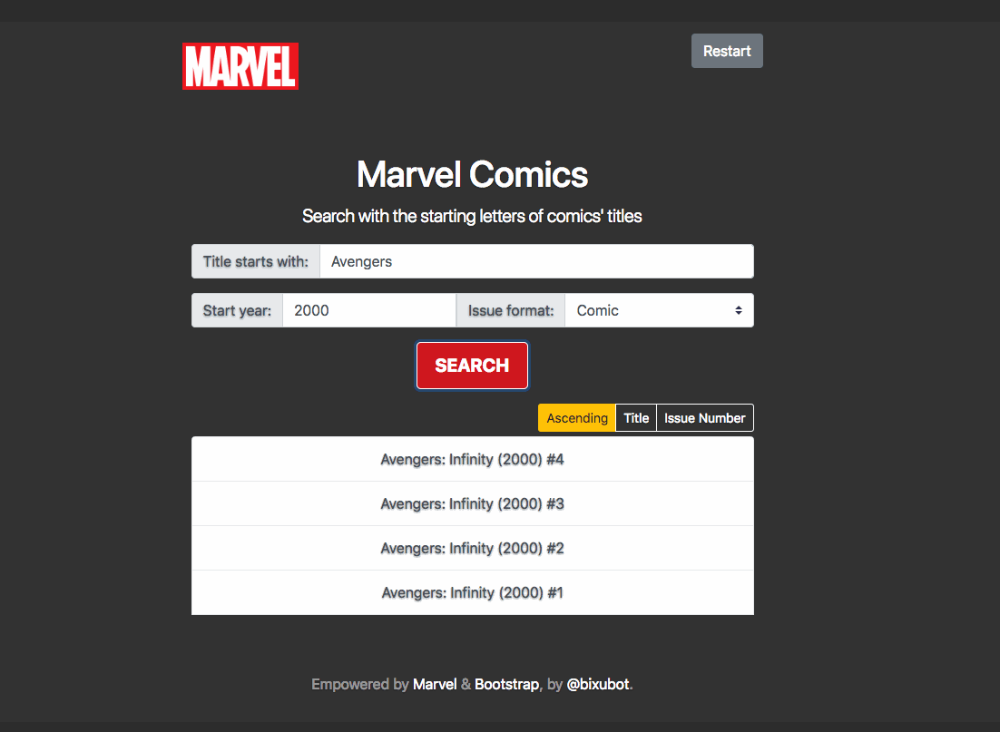
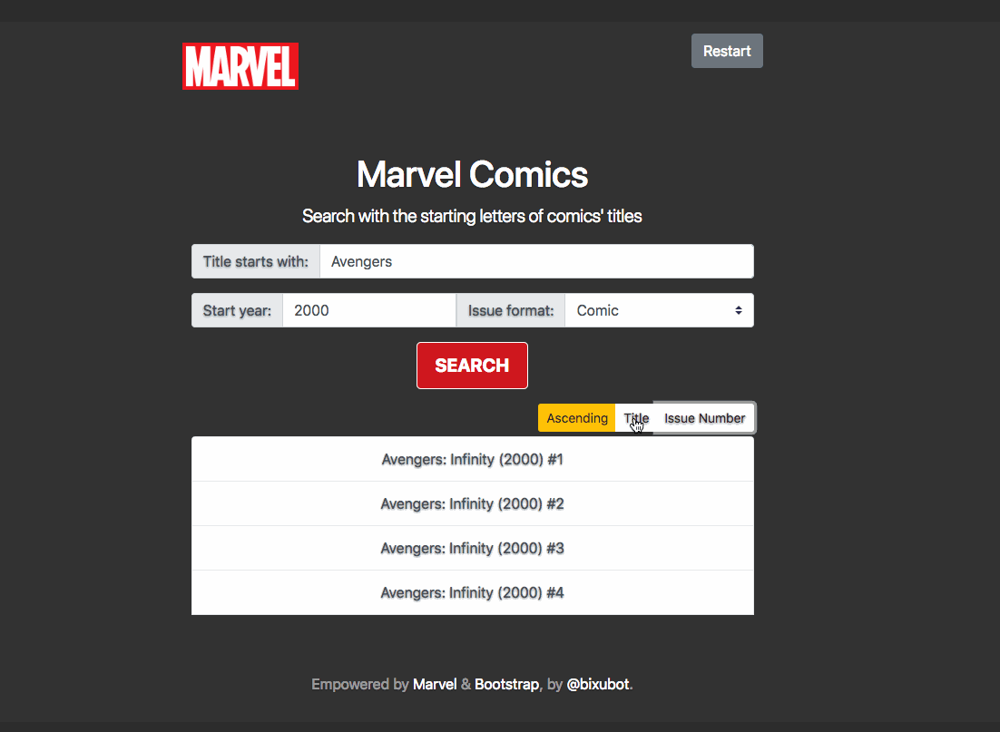

# Marvel Comic Research

The project is a simple design attempted using Bootstrap and Marvel API. The design process heavily focuses on Nielsen's Top 10 Usability Heuristics. Graphically, I tried to inherit Marvel's style with a bit of my own taste. Please see the following GIFs for some demonstrations.

---
### Front Page Onload
The default values for all three search inputs are pre-determined. The values are chosen to be popular searches and relatively small amount of search results that will be returned, so that users are less likely to be overwhelmed by the results but can still get a glimpse of the functions provided.

### Error Messages
Search inputs can not be blank or space only. It will raise alert boxes with brief input suggestions.

### Restart Button
A simple "Restart" is provided for users to rewind to the front page easily anytime during the use.

### Search
The searching process is monitored and displayed through a progress bar below the search results. 

### Search Result
The search result contains the cover image, comic description and the involved characters with their descriptions.

### Sort By
The search result usually contains multiple series of comics. Users can sort the comics solely based on their issue numbers or their titles, numerically and alphabetically ascending or descending.

